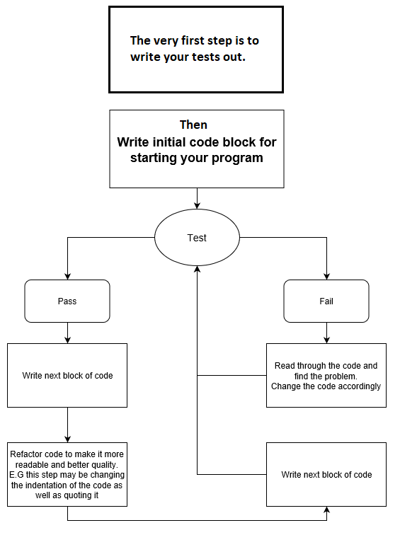

TDD Creator program

Small program that allows the user to create there own TDD

Different testing is important to be aware of. 
The first type of testing I will talk about is called feature testing. Feature testing essentially tests a program according to how it would be used, so for example user storys might say something like 'As a board game player, So that I can play a game, I want to be able to roll a dice'. In this case you would test the program according to how the user would use it, so the first feature test would be that there is a dice object and that he can roll the dice.

However the second type of testing is called unit testing. This includes testing smaller parts of the program in proportion, debugging it and making sure it all works as intended. This type of testing isn't surrounded by the users steps.
Below is a diagram of how you would test something

